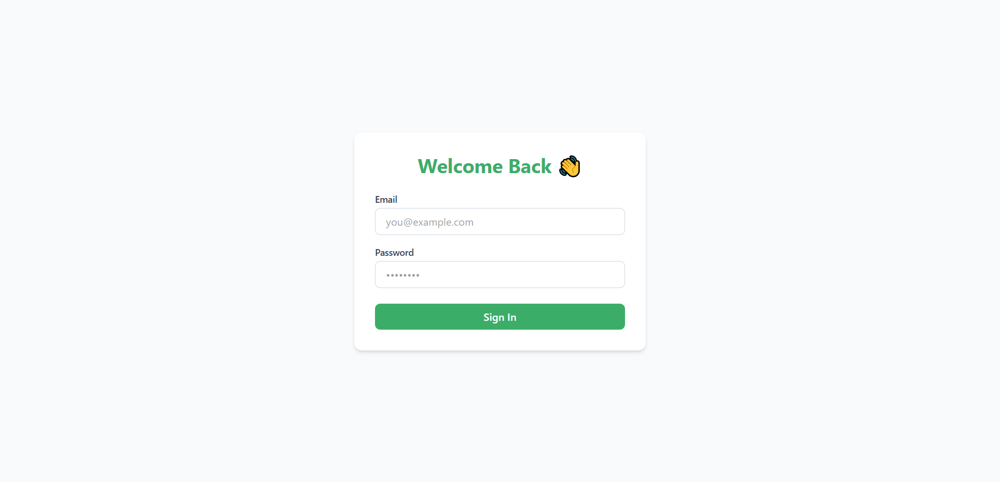
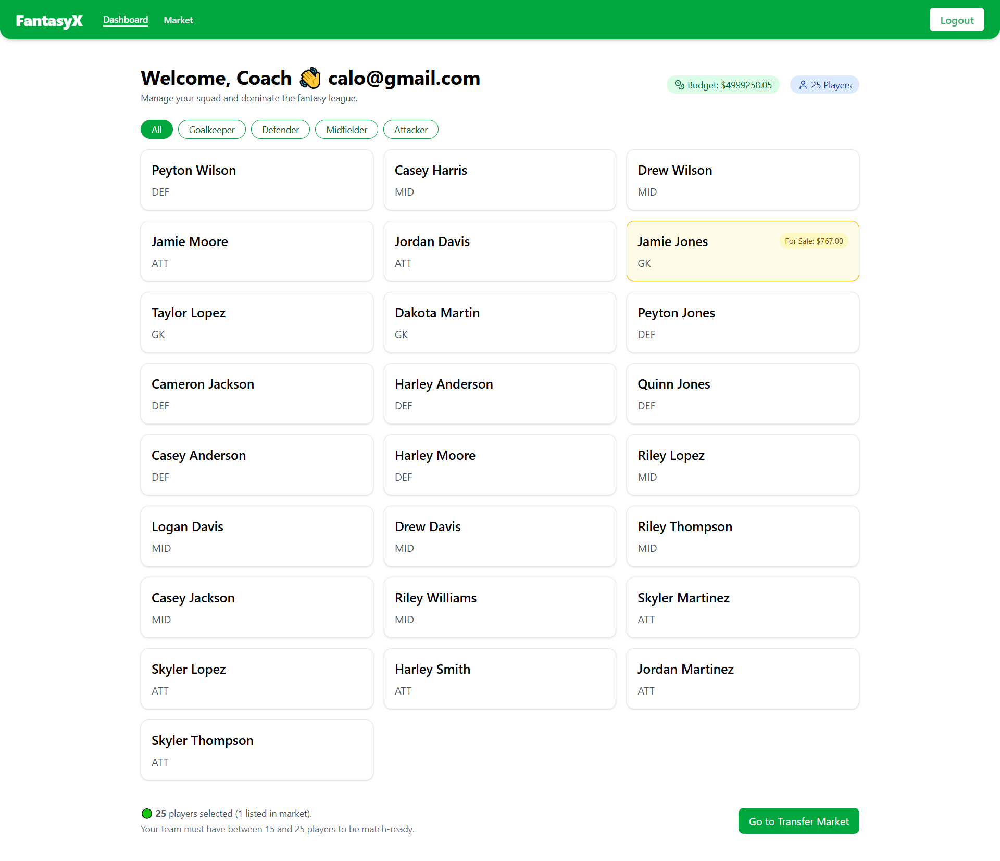
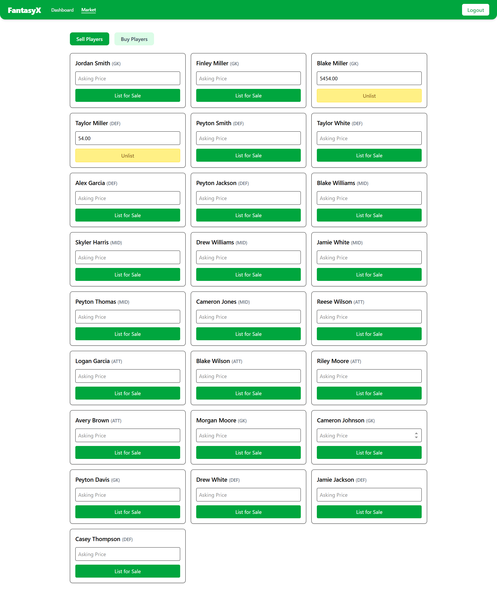
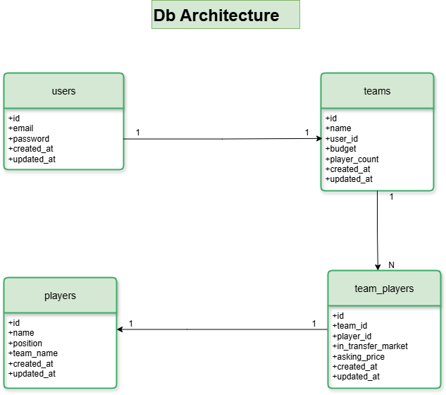

# ⚽ Football Fantasy Manager – Calo Technical Task

A fully functional, production-grade **Football Fantasy Manager** built for Calo’s technical task using a modern and scalable full-stack architecture (Node.js, Sequelize, React, Zustand, Tailwind CSS, MySQL).

> 🔥 All the provided requirements have been fully implemented: from seamless login/registration, automated team creation, to a live transfer market with real-time constraints and validations.

---

## 🚀 Features Overview

- 🧾 **Single Flow Auth** – Unified registration & login with JWT.
- 🧠 **Background Team Creation** – 20-player auto-generation post-registration with roles & budget handled via a custom in-memory job queue and worker.
- 🛒 **Transfer Market** – List/unlist players, set asking prices, and buy players from other teams (at 95% of the price).
- 🔎 **Filtering** – Transfer listing supports filters by team, name, and price.
- ⚖️ **Team Constraints** – Team size enforced between 15–25 players.
- 🖥️ **Dashboard** – Player breakdown, budget, and readiness status.

---

## 🎥 Demo

> Watch a quick walkthrough of the Football Fantasy Manager in action!

[🔗 Click to watch the demo on Loom](https://www.loom.com/share/d6a1a4199c034f1190326ab7895ac43e?sid=448c8384-3016-43d2-93ef-1b68655c1427)

## 🧰 Tech Stack

- **Frontend**: React, TypeScript, Tailwind CSS, Zustand
- **Backend**: Node.js, Express, Sequelize, MySQL
- **Auth**: JWT (Unified login/register)
- **Tools**: Vite, Axios, Joi, XAMPP

## 🔄 How It Works

1. New users register or log in via a unified auth flow.
2. A background worker creates a new team of 20 players with role/budget constraints.
3. The dashboard shows player distribution, budget, and readiness.
4. The transfer market allows listing, filtering, and buying players with team-size validation.

## 🧱 Folder Structure

### 📦 Backend (`Node.js`, `Express`, `Sequelize`, `MySQL`)

```

backend/
└── src/
├── config/           # DB config and constants
├── constants/        # Allowed Origins, messages, status-codes
├── controllers/      # API route handlers
├── data/             # Seed data for player generation
├── dtos/             # Joi validation schemas
├── middlewares/      # Auth
├── migrations/       # Sequelize migrations
├── models/           # Sequelize models
├── queues/           # In-memory queue implementation
├── routes/           # Route definitions
├── services/         # Business logic
├── types/            # TypeScript types/interfaces
├── utils/            # Helper utilities
├── workers/          # Background worker to process queue
├── app.ts            # Express app setup
└── server.ts         # App entry point

```

### 🌐 Frontend (`React`, `TypeScript`, `Tailwind`, `Zustand`)

```

frontend/
└── src/
├── api/              # Axios services
├── assets/           # Static files/images
├── auth/             # Auth and guards
├── components/       # Reusable UI components
├── hooks/            # useAuth, usePolling, useDebouncedFilters
├── layouts/          # App layouts
├── pages/            # Dashboard and Market views
├── routes/           # Route definitions
├── store/            # Zustand stores for market & team
├── types/            # Frontend types
├── utils/            # Utility functions
├── App.tsx           # Main React component
└── main.tsx          # App entry

````

---

## 🛠️ Setup Guide

### 🔧 Requirements

- Node.js `v20.19.0`
- XAMPP (for MySQL)
- MySQL `localhost` instance

---

### ✅ Backend Setup

1. **Clone & install**
   ```bash
   git clone https://github.com/Sheryar-Ahmed/football-manager-task.git
   cd backend
   npm install
````

2. **Start MySQL via XAMPP**

   * Open XAMPP and start the MySQL service.
   * Create a new database `fantasy_manager` in phpMyAdmin:

     ```sql
     CREATE DATABASE fantasy_manager;
     ```

3. **Configure `.env`**

   Rename `.env.example` to `.env` and fill in your local config:

   ```env
   PORT=5000
   DB_HOST=localhost
   DB_PORT=3306
   DB_USER=root
   DB_PASSWORD=
   DB_NAME=fantasy_manager
   JWT_SECRET=your_secret_key
   ```

4. **Run Migrations**

   ```bash
   npm run migrate
   ```

5. **Start Backend Server**

   ```bash
   npm run dev
   ```

   This will also start the **in-memory background worker** which checks the queue every second to create new teams asynchronously.

---

### 💻 Frontend Setup

1. **Navigate & install**

   ```bash
   cd ../frontend
   npm install
   ```

2. **Set up environment variables**

   Create a `.env` file by copying the provided example:

   ```bash
   cp .env.example .env
   ```

   Then update the `VITE_API_BASE_URL` value in `.env` to point to your backend URL (default is `http://localhost:5000/api`):

   ```env
   VITE_API_BASE_URL=http://localhost:5000/api
   ```

3. **Run the frontend**

   ```bash
   npm run dev
   ```

   App will be live at: `http://localhost:5173`

---

---

## 🖼️ Screenshots

### 🟢 Login/Register


### ⚽ Dashboard
Shows team overview, player breakdown, and budget.



### 💸 Transfer Market
List, unlist, and buy players with filters and constraints.




---


### 🖼️ Database Architecture



> The database schema is normalized to efficiently manage Users, Teams, Players, and Transfers with relational integrity and scalability in mind.

---

## ⚔️ Challenges Faced

| Challenge                | Solution                                                                                         |
| ------------------------ | ------------------------------------------------------------------------------------------------ |
| ⏱️ Async Team Creation   | Implemented a custom in-memory queue + background worker service to avoid blocking registration. |
| 🔐 Unified Auth Flow     | Combined registration and login into a single route intelligently checking if the user exists.   |
| 📊 Player Role Balancing | Generated role-specific players to ensure 3 GK, 6 DEF, 6 MID, 5 FWD per team.                    |
| 🛒 Transfer Filtering    | Frontend + backend filtering (by name, team, price) using debounce + query params.               |
| 🧮 Team Size Enforcement | Checks after each buy/sell to ensure team size remains between 15–25.                            |
| 🔁 Real-time Updates     | Used polling + Zustand for reactive UI updates in both dashboard and market.                     |

---

## 📄 .env.example

```env
PORT=5000
DB_HOST=localhost
DB_PORT=3306
DB_USER=root
DB_PASSWORD=
DB_NAME=fantasy_manager
JWT_SECRET=supersecretjwtkey
```

---

## 🎯 Final Notes

✅ Fully implemented all product requirements.
🧠 Thoughtful architecture using queues and services.
💡 Clean, type-safe, and maintainable full-stack code.
🌱 Ready for future growth, CI/CD, and deployment.

---

## 🙌 Thank You, Calo Team!

This project reflects my engineering mindset and product intuition.
Looking forward to bringing this energy and ownership to **Calo**.

---
